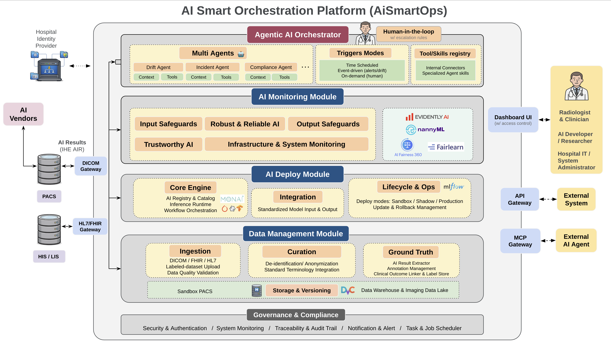

System architecture ของ AISmartOps — เราออกแบบให้โรงพยาบาลสามารถ monitor, deploy, และ govern AI หลายๆ ตัวพร้อมกันได้อย่างมีมาตรฐาน โดยประกอบด้วย Module หลัก 3 Modules ได้แก่

{fig-align="center"}

## 1. Data Management Module

จัดเป็นพื้นฐานที่สำคัญของ platform ทำหน้าที่จัดการ data ที่ใช้ใน platform รวมถึง ground truth เพื่อใช้ทดสอบในช่วงเฟสที่ 1 Pre-Installation Evalution และเฟสที่ 2 Shadow Mode

ซึ่ง เราวางแผนว่า platform สามารถรับ

- Ground truth จากการ upload labeled dataset หรือ
- Automatic ground truth generation: จากการ extract label จากข้อมูลที่มีอยู่ในระบบโรงพยาบาล โดยมีการทำ de-identification, mapping กับ standard terminology, และ extract ข้อมูลจาก radiology reports เพื่อสร้าง ground truth labels โดยอัตโนมัติ

## 2. AI Deploy Module

ลำดับถัดมาคือ AI Deploy Module: ทำหน้าที่เป็นตัวช่วยจัดการ deploy AI model ที่ทางนักวิจัย หรือ AI vendor ต้องการนำ AI model ที่ตนได้พัฒนามาแล้ว นำมาเชื่อมต่อกับระบบในโรงพยาบาล (เช่นระบบ PACS)

เราออกแบบให้สามารถรองรับ model ได้หลายรูปแบบ และ มี standard​ize รูปร่าง/การเชื่อมต่อของ data input ที่ส่งมายัง model และ prediction output ที่ model ให้อย่างเป็นมาตรฐาน

### Deploy modes

1. **Sandbox**: deploy โดยที่ input/output data อยู่ใน platform ทั้งหมด
2. **Shadow**: deploy โดยที่ใช้ input จากในหรือนอก platform ก็ได้ แต่ output จะแสดงเฉพาะใน platform (ยังไม่ใช้จริงทางคลินิก) แต่ให้แพทย์หรือผู้เชี่ยวชาญตรวจสอบได้
3. **Production**: deploy โดยส่ง input/output กับ production system จริง

## 3. AI Monitoring Module

โมดูลที่ 3 ซึ่งเป็นโมดูลหลัก คือ AI Monitoring Module: ทำหน้าที่ตรวจสอบและกำกับดูแล AI ที่ deploy ในโรงพยาบาล โดยครอบคลุมทั้งหมดของกระบวนการใช้งาน ได้แก่

- Input data ที่ส่งให้ AI หรือเรียกว่า input safeguard
- ความน่าเชื่อถือ ความมั่นใจ และความแม่นยำของ AI (robustness & reliable AI)
- มุมมองของ output safeguard เช่น การกระจายตัวของ AI prediction results
- Trustworthy เป็นการประเมินใน dimensions ต่างๆมากไปกว่าประสิทธิภาพของ AI เช่น fairness, explainability, privacy (fairness audits ว่า AI ให้การวินิจฉัยเท่าเทียมกันใน subgroup ของประชากร เช่น เชื้อชาติ, เพศ)
- และท้ายสุดคือการกำกับดูแล/ประเมิน Infrastructure & system monitoring

โดยด้านขวามือนี้จะแสดง open-source library ที่จะใช้ในการ implement algorithm ใน platform เพื่อช่วยให้ monitor AI ได้

## Agentic AI Orchestrator

นอกจาก 3 โมดูล ดังกล่าว เพื่อมีความสมบูรณ์ของ platform และเกิดประสิทธิภาพการใช้งานอย่างแท้จริง โครงการจะพัฒนา Agentic AI Orchestrator:

เป็นชั้น AI agent ของ platform โดยจะมี specialized agents หลายตัว ทำหน้าที่จำเพาะของตน โดยจะมีการกำหนด prompt (context) และ เครื่องมือ (tools) และ ความสามารถเฉพาะหน้า (skills) ทีให้ agent เหล่านี้เชื่อมต่อกับระบบหรือโมดูลต่าง ๆ ได้

### Trigger Modes

เราสามารถกำหนดการทำงานของ agent ได้ เช่น

- **Time schedule** (ตามเวลาที่กำหนด)
- **Event driven** (เมื่อมี notification หรือ alert จาก module ต่างๆ)
- **On-demand** (human เป็นผู้เรียกสั่ง)

### Human-in-the-loop

ระบบของเรามีการออกแบบให้มี human in the loop โดย agent สามารถส่ง notification ให้มนุษย์ได้ ตาม escalation rule ที่กำหนด
